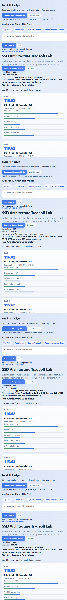

# SSD Architecture Tradeoff Lab

SSD Architecture Tradeoff Lab is a local design-analysis tool for comparing SSD architecture options across performance, endurance, cost, power, and implementation complexity.

## Product Screenshot



It combines deterministic design-space evaluation with a local AI analyst so users can understand the tradeoff reasoning behind the selected architecture.

## What It Does

- Loads SSD design-space options from JSON.
- Evaluates architecture candidates across multiple weighted criteria.
- Ranks design options and highlights tradeoff drivers.
- Displays results in a browser UI.
- Adds AI analyst and chat endpoints for architecture explanation.

## AI Features

- Local AI analyst summarizes why an SSD design option wins or loses.
- AI chat answers questions about endurance, latency, cost, power, and risk tradeoffs.
- AI recommendations are grounded in deterministic scorecard results.
- Browser UI exposes both score data and AI explanation.

## Architecture

```text
Design-space JSON
      |
      v
SSD evaluator -> weighted scores -> architecture ranking
      |
      v
Local AI analyst / chat -> design rationale + next experiment
      |
      v
Browser dashboard
```

## Run

```powershell
run.bat
```

## Local AI Setup

The project supports LM Studio or another local OpenAI-compatible server. It defaults to small local models such as `google/gemma-4-e4b`.

The deterministic evaluator works without AI.

## Main Files

- `src/ssd_architecture_tradeoff_lab/evaluator.py` - scorecard and ranking.
- `src/ssd_architecture_tradeoff_lab/ai_analyst.py` - local AI analyst and chat logic.
- `server.py` - local web API.
- `samples/design_space.json` - candidate architecture data.
- `web/` - dashboard UI.

## Output

The dashboard shows ranked SSD architecture options, score components, risk notes, and AI-generated design guidance.
